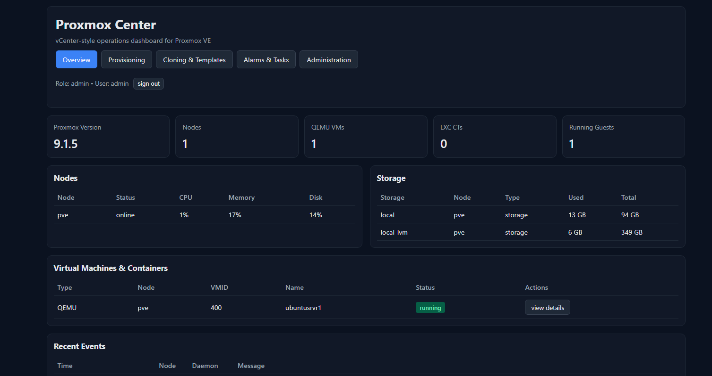
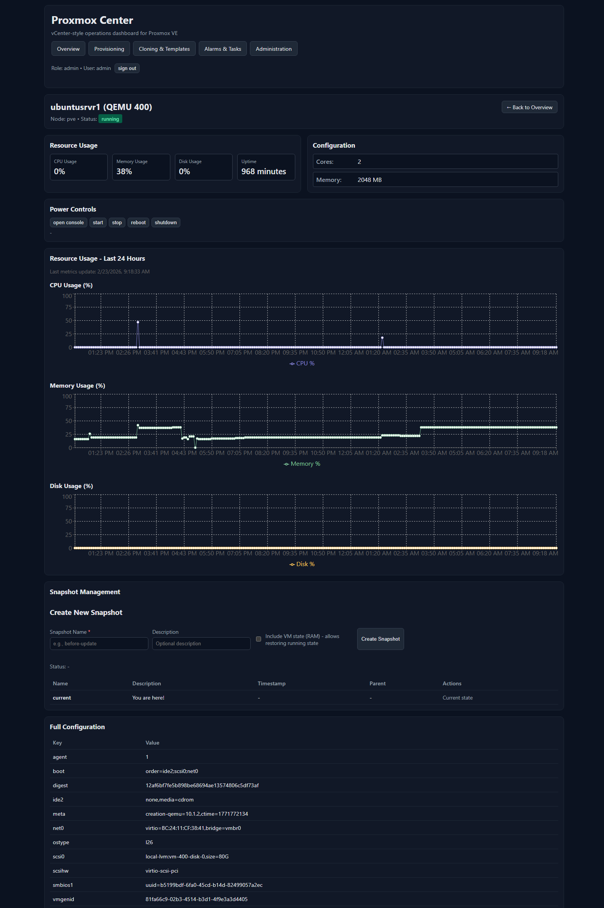
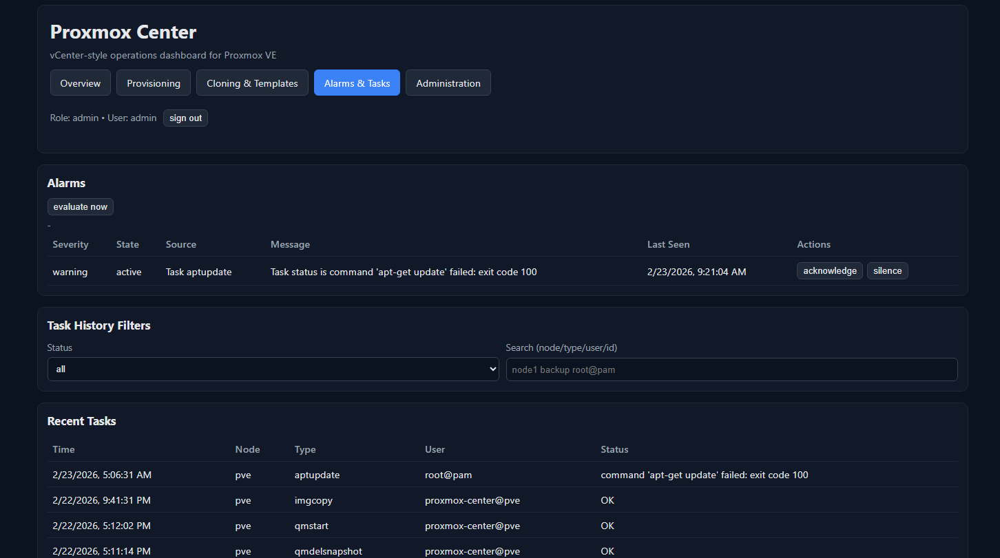
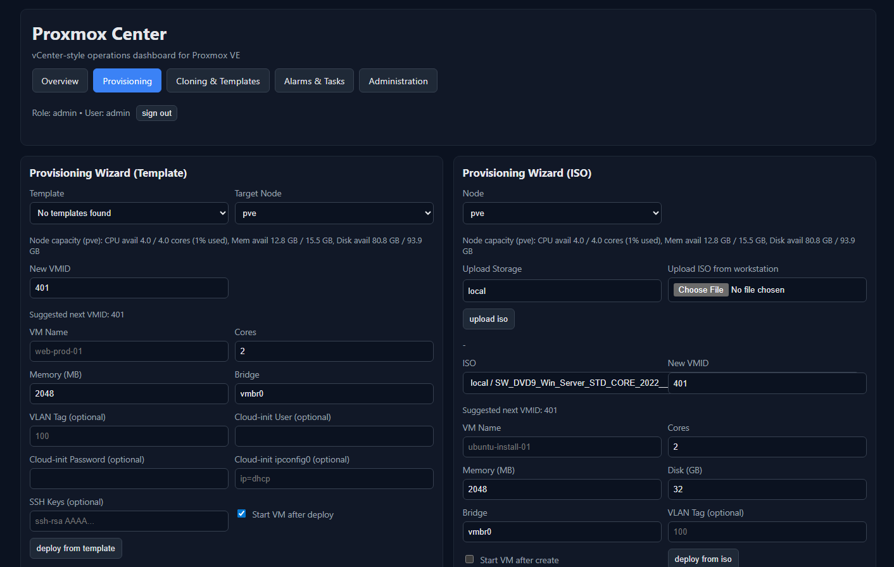

# Proxmox Center

A plug-and-play, vCenter-like starter app for Proxmox VE.

This README is the complete install and access-rights guide, including how to create the Proxmox API user/token and ACLs so first-time setup works end-to-end.

## Quick path

If you want the fastest copy/paste setup first, start here:

- `docs/setup-walkthrough.md` → **5-minute quick path (token mode)**

## What this includes

- Proxmox API integration with token auth **or** user/password auth
- Dashboard overview (nodes, VMs, containers, storage, cluster health)
- Recent tasks and recent cluster events
- Guest power, snapshots, cloning, template conversion
- Template and ISO-based provisioning workflows
- Optional app-level auth/RBAC (`viewer`, `operator`, `admin`)
- Alarm engine + webhook notifications

## Screenshots


### Overview



### Guest detail + metrics



### Alarms



### Provisioning



## Prerequisites

- Node.js 20+ and npm
- A reachable Proxmox VE API endpoint (example: `https://<proxmox-host>:8006`)
- A Proxmox account/token with sufficient rights (see below)

---

## 1) Create a Proxmox API user/token and assign access rights

You have two supported approaches.

### Option A (fastest, guaranteed to work): API token with full admin rights

Use this if you want the app to work immediately with all built-in operations.

1. In Proxmox UI, go to **Datacenter → Permissions → Users**.
2. Create a service user (example: `proxmox-center@pve`) or use an existing admin user.
3. Go to **Datacenter → Permissions → API Tokens**.
4. Create a token for that user (example token name: `app`).
5. Copy/save the token secret (shown once).
6. Go to **Datacenter → Permissions → Add** and grant an ACL on path `/` with an admin-capable role for this user/token.

Then set:

- `PROXMOX_AUTH_MODE=token`
- `PROXMOX_API_TOKEN_ID=<user@realm!tokenname>`
- `PROXMOX_API_TOKEN_SECRET=<token-secret>`

Example token id format:

- `proxmox-center@pve!app`
- `root@pam!api`

### Option B: username/password auth

Set:

- `PROXMOX_AUTH_MODE=password`
- `PROXMOX_USERNAME=<username-without-realm>` (example: `root`)
- `PROXMOX_PASSWORD=<password>`
- `PROXMOX_REALM=<realm>` (default: `pam`)

### Rights needed by feature (for least-privilege planning)

If you do not use full admin rights, make sure your assigned role(s) allow these operations:

- **Read-only dashboard**: cluster/nodes/storage/resources/tasks/log visibility
- **Power operations**: start/stop/reboot/shutdown VMs and LXC
- **Snapshots**: list/create/rollback/delete
- **Clone/template**: clone guests, convert QEMU VM to template
- **Provisioning**: create/configure QEMU VMs, read storage content, upload ISO, attach disks/ISO, optional cloud-init config

If any permission is missing, affected API calls will return Proxmox authorization errors.

### CLI setup example (copy/paste on a Proxmox node)

If you prefer command-line setup, run these in the Proxmox shell (as root), then use the resulting token in `apps/server/.env`.

```bash
# 1) Create service user (skip if it already exists)
pveum user add proxmox-center@pve --comment "Proxmox Center API user"

# 2) Create custom role (if already created, use the modify command below instead)
pveum role add ProxmoxCenterRole -privs "VM.Audit VM.Allocate VM.PowerMgmt VM.Config.CPU VM.Config.Memory VM.Config.Network VM.Config.Options VM.Config.Disk VM.Config.HWType VM.Clone VM.Snapshot Datastore.Audit Datastore.AllocateSpace Datastore.AllocateTemplate Sys.Audit Pool.Audit SDN.Use"

# 3) If role already exists, update it to this exact privilege set
pveum role modify ProxmoxCenterRole -privs "VM.Audit VM.Allocate VM.PowerMgmt VM.Config.CPU VM.Config.Memory VM.Config.Network VM.Config.Options VM.Config.Disk VM.Config.HWType VM.Clone VM.Snapshot Datastore.Audit Datastore.AllocateSpace Datastore.AllocateTemplate Sys.Audit Pool.Audit SDN.Use"

# 4) Assign role at Datacenter root so the app can work across resources
pveum aclmod / -user proxmox-center@pve -role ProxmoxCenterRole

# 5) Create API token for the user (save the token value shown once)
pveum user token add proxmox-center@pve app --privsep 0
```

Then set:

- `PROXMOX_AUTH_MODE=token`
- `PROXMOX_API_TOKEN_ID=proxmox-center@pve!app`
- `PROXMOX_API_TOKEN_SECRET=<token-value-from-command-output>`

Quick verification on Proxmox shell:

```bash
pveum role show ProxmoxCenterRole
pveum acl list | grep proxmox-center@pve
pveum user token list proxmox-center@pve
```

---

## 2) Install and configure the app

From the repo root:

```bash
npm install
npm run setup
```

This creates:

- `apps/server/.env` (from `.env.example` if missing)
- `apps/web/.env` (from `.env.example` if missing)

Now edit `apps/server/.env` and set at minimum:

```dotenv
PROXMOX_BASE_URL=https://YOUR_PROXMOX_IP_OR_DNS:8006
PROXMOX_ALLOW_SELF_SIGNED=true

PROXMOX_AUTH_MODE=token
PROXMOX_API_TOKEN_ID=proxmox-center@pve!app
PROXMOX_API_TOKEN_SECRET=replace_with_secret
```

For password mode instead:

```dotenv
PROXMOX_AUTH_MODE=password
PROXMOX_USERNAME=root
PROXMOX_PASSWORD=replace_with_password
PROXMOX_REALM=pam
```

Web API base URL is in `apps/web/.env`:

```dotenv
VITE_API_BASE_URL=http://localhost:4000/api
```

---

## 3) (Optional) Enable app login + RBAC

If you want Proxmox Center users/roles in the UI, run:

```bash
npm run setup:auth
```

This will:

- enable `APP_AUTH_ENABLED=true`
- generate `APP_JWT_SECRET` if placeholder
- set `APP_USERS_FILE=apps/server/data/users.json`
- generate `APP_BOOTSTRAP_ADMIN_PASSWORD` if empty

On first run, if no users file exists, an admin is bootstrapped from:

- `APP_BOOTSTRAP_ADMIN_USERNAME` (default `admin`)
- `APP_BOOTSTRAP_ADMIN_PASSWORD`

App roles:

- `viewer`: read-only dashboards
- `operator`: viewer + power actions + snapshot create + clone + alarm acknowledge/silence
- `admin`: operator + snapshot rollback/delete + template conversion + user/policy admin + force alarm evaluation

More details: `docs/permissions.md`.

---

## 4) Run

```bash
npm run dev
```

- Web UI: `http://localhost:5173`
- API base: `http://localhost:4000/api`
- Health check: `http://localhost:4000/api/health`

## 5) Verify connectivity quickly

Once running, verify Proxmox API access:

- `GET /api/proxmox/version`
- `GET /api/proxmox/overview`

If app auth is enabled, log in first in the UI, or call `POST /api/auth/login` and use the bearer token.

---

## Common startup issues (and fixes)

- **`npm run dev` exits immediately**
	- Run `npm run build` to surface TypeScript/config errors.
	- Check `apps/server/.env` for missing required values.
	- `PROXMOX_BASE_URL` must be a valid URL.
	- In token mode, both `PROXMOX_API_TOKEN_ID` and `PROXMOX_API_TOKEN_SECRET` are required.
	- In password mode, both `PROXMOX_USERNAME` and `PROXMOX_PASSWORD` are required.

- **Proxmox SSL/certificate errors**
	- For self-signed lab environments, set `PROXMOX_ALLOW_SELF_SIGNED=true`.

- **401/permission errors from Proxmox endpoints**
	- Re-check token format: `user@realm!tokenname`.
	- Confirm token secret is current.
	- Confirm ACL rights cover the features you are using.

- **Port conflicts on 4000 or 5173**
	- Stop existing processes using those ports, then re-run `npm run dev`.

---

## API surface (starter)

- `GET /api/health`
- `GET /api/proxmox/version`
- `GET /api/proxmox/nodes`
- `GET /api/proxmox/storage`
- `GET /api/proxmox/cluster/status`
- `GET /api/proxmox/tasks/recent?limit=25`
- `GET /api/proxmox/events/recent?limit=25`
- `GET /api/proxmox/overview`
- `POST /api/proxmox/guests/:type/:node/:vmid/:action`
- `GET /api/proxmox/tasks/:upid/status?node=:node`
- `GET /api/proxmox/guests/:type/:node/:vmid/snapshots`
- `POST /api/proxmox/guests/:type/:node/:vmid/snapshots`
- `POST /api/proxmox/guests/:type/:node/:vmid/snapshots/:snapname/rollback`
- `DELETE /api/proxmox/guests/:type/:node/:vmid/snapshots/:snapname`
- `POST /api/proxmox/guests/:type/:node/:vmid/clone`
- `POST /api/proxmox/guests/:type/:node/:vmid/template` (QEMU only)
- `GET /api/proxmox/provisioning/templates`
- `POST /api/proxmox/provisioning/deploy-template`
- `GET /api/proxmox/provisioning/isos?node=:node`
- `POST /api/proxmox/provisioning/deploy-iso`
- `GET /api/alarms`
- `POST /api/alarms/:id/acknowledge`
- `POST /api/alarms/:id/silence`
- `POST /api/alarms/evaluate` (admin)
- `GET /api/alarms/notifications` (admin delivery audit)

## Built-in operations

- Guest power actions from UI: `start`, `stop`, `reboot`, `shutdown`
- Action execution uses Proxmox task UPID and polls status until completion
- Snapshot lifecycle from UI: `create`, `rollback`, `delete`
- Rollback and delete require explicit browser confirmation
- Task history supports status + text filters (node/type/user/id)
- Guest clone workflow from UI with VMID collision guardrail
- VM-to-template conversion workflow (QEMU-only, requires stopped VM, confirmation prompt)
- Template-based provisioning wizard (clone template + optional cloud-init + optional auto-start)
- ISO-based provisioning wizard (installer-ready VM with ISO attach + boot order + optional auto-start)
- Alarm engine with periodic health evaluation (node state/cpu/memory/disk, storage usage, failed tasks)
- Role-based alarm actions: viewer can view, operator/admin can acknowledge/silence, admin can force evaluation
- Webhook notifications for newly critical alarms (generic/slack/teams payload formats)
- Webhook delivery retry with exponential backoff and admin audit log endpoint

## Project layout

- `apps/server`: Express API, Proxmox auth/session handling, metrics/alarms/policy routes
- `apps/web`: React dashboard and operations UI
- `docs/setup-walkthrough.md`: copy/paste command walkthrough for first-time setup
- `docs/permissions.md`: app RBAC model + guardrails
- `CONTRIBUTING.md`: contributor workflow
